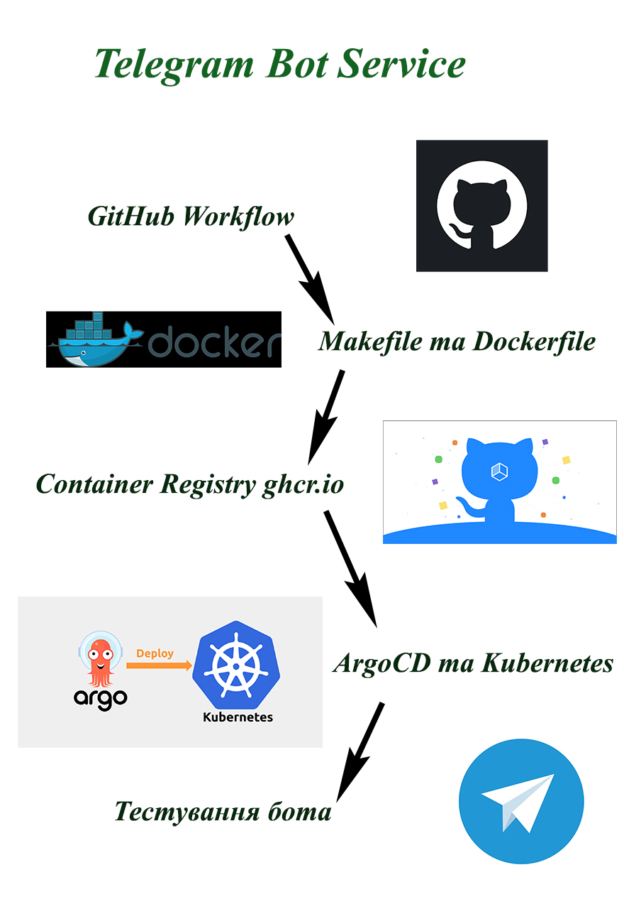
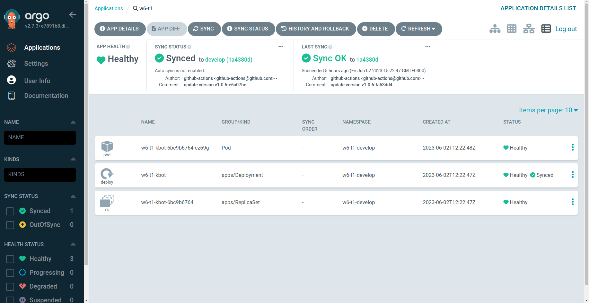
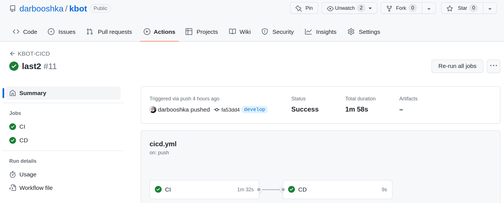
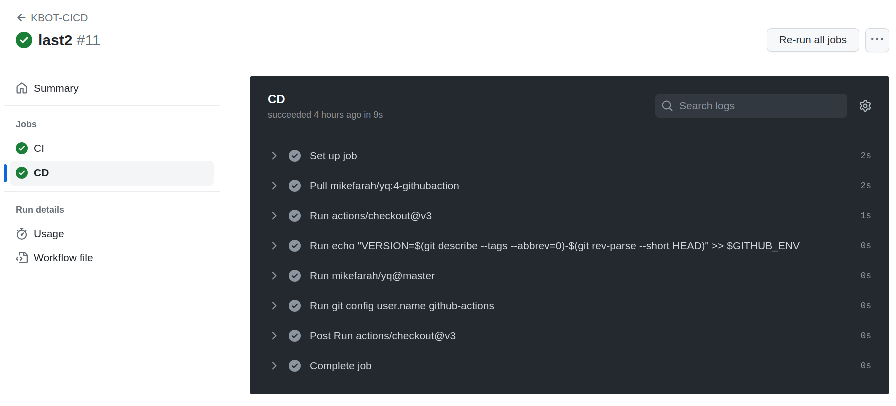

# kbot

devops application from scratch


# build instructions

To build for linux run the following command:

```
make linux build
```

To build for macos run the following command:

```
make macos build
```

To build for windows run the following command:

```
make windows build
```

To build for arm run the following command:

```
$ make build TARGETARCH=arm64
```

To make Docker container image for MacOs arm run the following command:

```
$ make macos image TARGETARCH=arm64
```

To make Docker container image for Windows arm run the following command:

```
$ make windows image TARGETARCH=arm64
```




----



----



----



